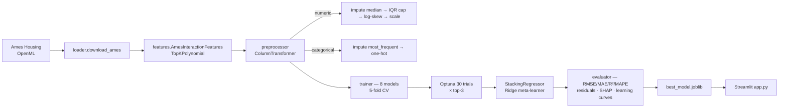

# 🏡 House Price Prediction

A production-grade regression pipeline on the **Ames Housing** dataset — from
raw CSV to a tuned, stacked ensemble served through a Streamlit app. Built to
demonstrate end-to-end ML engineering practice: no data leakage, reproducible
seeds, sklearn-native transformers, tests, CI, and a SHAP-powered demo.

---

## Results

Hold-out results (`make tune`, seed 42, 5-fold CV, 30 Optuna trials × top-3):

| Model (hold-out) | RMSE (log) | MAE (log) | MAPE % | R² |
| --- | ---: | ---: | ---: | ---: |
| **elasticnet** (best) | **0.1277** | **0.0821** | **0.69** | **0.913** |
| stacking (Ridge meta) | 0.1295 | 0.0830 | 0.70 | 0.910 |
| lasso | 0.1305 | 0.0834 | 0.70 | 0.909 |
| ridge | 0.1312 | 0.0851 | 0.72 | 0.908 |
| xgboost | 0.1320 | 0.0866 | 0.73 | 0.907 |
| linear | 0.1334 | 0.0898 | 0.75 | 0.905 |
| gradient_boosting | 0.1362 | 0.0880 | 0.74 | 0.901 |
| lightgbm | 0.1370 | 0.0894 | 0.75 | 0.899 |
| random_forest | 0.1467 | 0.0965 | 0.81 | 0.885 |

Full table: [`reports/model_comparison.csv`](reports/model_comparison.csv).

Best model is persisted to `models/best_model.joblib` as a full sklearn
`Pipeline` (feature engineering → preprocessing → estimator), so inference is
a one-liner:

```python
import joblib, pandas as pd, numpy as np
art = joblib.load("models/best_model.joblib")
price = np.expm1(art["pipeline"].predict(pd.read_csv("my_house.csv")))
```

---

## Pipeline architecture



All transformations are fitted on the training split only, so there is no
leakage between train and test. Random seeds are set globally (`src.pipeline.set_global_seed`)
and propagated to every estimator.

---

## Quick start

```bash
git clone https://github.com/walkinn/house-price-prediction.git
cd house-price-prediction
python -m venv .venv && source .venv/Scripts/activate   # Win: .venv\Scripts\Activate.ps1

make install        # install dependencies
make data           # fetch Ames Housing from OpenML (~500 KB cache in data/raw/)
make train          # baseline CV + hold-out evaluation (~1 min on CPU)
# or:
make tune           # add Optuna tuning on top-3 models + stacking (~3–10 min)
make app            # launch Streamlit demo at http://localhost:8501
```

Python 3.11+. No API keys needed.

---

## Usage

| `make` target | What it does |
| --- | --- |
| `install` | `pip install -r requirements.txt` |
| `data` | Downloads Ames from OpenML into `data/raw/ames.csv` (idempotent) |
| `train` | Runs `python -m src.pipeline --model all` (no tuning) |
| `tune` | Runs `python -m src.pipeline --model all --tune` (Optuna on top-3) |
| `evaluate` | Re-runs evaluation-only against the current best model |
| `app` | `streamlit run app.py` |
| `test` | `pytest -q` |
| `lint` | `ruff check src tests` |
| `clean` | Remove caches, models, figures, experiment log |

### Pipeline CLI

```bash
python -m src.pipeline --help
python -m src.pipeline --model xgboost --tune --trials 60 --seed 7
python -m src.pipeline --cv-folds 10 --output-dir reports/experiment_2
```

Each run appends a structured entry to `reports/experiment_log.json`.

---

## EDA highlights

See the full interactive notebook at
[notebooks/eda.ipynb](notebooks/eda.ipynb). Key findings that shaped the
pipeline:

1. **Right-skewed target** — raw skew ≈ 1.88 → 0.12 after `log1p`. All
   training runs on log-dollars; the Streamlit app converts back with `expm1`.
2. **Structural missingness** — columns like `PoolQC`, `Alley`, `Fence`
   are missing by design (no pool, no alley). The preprocessor flags these
   with `add_indicator=True` so "absence" is itself a feature.
3. **Highly collinear numeric clusters** — e.g. `GarageCars ↔ GarageArea`
   (|r| ≈ 0.88). Collapsed via the engineered `TotalSF` / `TotalBath`
   features and dropped with `CorrelationThreshold`.
4. **Non-linear categorical effects** — neighborhood median prices span
   ~3×. Tree ensembles dominate the CV ranking.

---

## Project structure

```
house-price-prediction/
├── data/raw/              # downloaded datasets (gitignored)
├── data/processed/        # intermediate artifacts (gitignored)
├── notebooks/
│   ├── eda.ipynb          # polished, executed EDA
│   └── build_eda.py       # regenerates the notebook cells
├── src/
│   ├── config.py          # single frozen Config dataclass
│   ├── pipeline.py        # `python -m src.pipeline` entry point
│   ├── data/
│   │   ├── loader.py      # fetches Ames from OpenML and caches
│   │   └── preprocessor.py
│   ├── features/
│   │   └── engineer.py    # domain interactions, poly, MI selection
│   └── models/
│       ├── trainer.py     # catalog + CV + Optuna + stacking
│       └── evaluator.py   # metrics, residuals, SHAP, learning curves
├── models/                # best_model.joblib (gitignored)
├── reports/
│   ├── figures/           # saved plots (residuals, SHAP, learning curves)
│   ├── model_comparison.csv
│   ├── cv_ranking.csv
│   └── experiment_log.json
├── tests/                 # pytest suite with synthetic-data fixtures
├── app.py                 # Streamlit demo (single + batch + SHAP)
├── Makefile
├── pyproject.toml
├── requirements.txt
└── .github/workflows/ci.yml
```

---

## Tech stack

- **Python 3.11+**
- **pandas / numpy / scipy** — data handling
- **scikit-learn 1.4+** — pipelines, `ColumnTransformer`, `StackingRegressor`
- **XGBoost · LightGBM** — gradient-boosted trees
- **Optuna** — Bayesian hyper-parameter tuning
- **SHAP** — model explanations (beeswarm + waterfall)
- **matplotlib · seaborn** — publication-quality plotting
- **Streamlit** — demo application
- **pytest · ruff** — tests and linting
- **GitHub Actions** — CI on every push

---

## Reproducibility notes

- Random seed (default 42) is set for Python, NumPy, every sklearn estimator,
  XGBoost, LightGBM, and the Optuna sampler.
- All transformations — including log-transforms, outlier caps, and feature
  selection thresholds — are *learned* on the training fold and re-applied to
  the test fold.
- The saved `best_model.joblib` bundles the feature pipeline, preprocessor
  and model together, so loading it and calling `.predict()` on a raw
  DataFrame is sufficient for inference.

---

## Future improvements

- Optional Bayesian quantile regression for proper prediction intervals
  (current app uses a rough RMSE-based band).
- MLflow tracking for `reports/experiment_log.json` entries.
- Model-card generation (`model_card_toolkit`) with fairness slices by
  Neighborhood.
- Docker image so the Streamlit app can be deployed without installing the
  Python stack locally.

---

## License

MIT.
